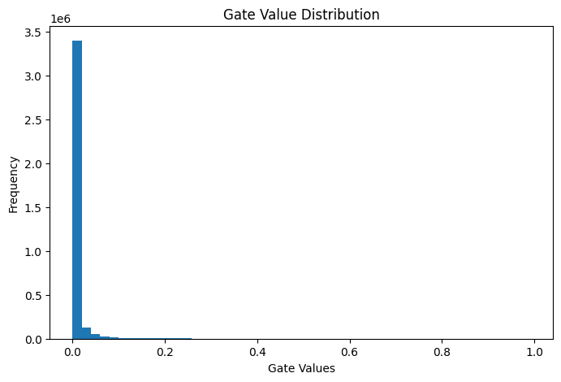

# 🧠 Self-Pruning Neural Networks: Dynamic Sparsity Learning for Efficient Image Classification

## 📌 Overview
This project implements a **self-pruning neural network** for CIFAR-10 image classification. Unlike traditional pruning methods applied after training, this model learns to **prune itself during training** using learnable gate parameters.

Each weight is paired with a gate value (between 0 and 1). During training, less important connections are suppressed as their gate values approach zero, resulting in a **sparse and efficient neural network**.

---

## ⚙️ Methodology

### 🔹 Prunable Linear Layer
- Custom `PrunableLinear` layer replaces `nn.Linear`
- Each weight has a **learnable gate parameter**
- Gates are passed through **sigmoid activation** → values between 0 and 1
- Final weight used in computation:

---

### 🔹 Sparsity Regularization

To encourage pruning, an L1 penalty is added:

- **SparsityLoss** = sum of all gate values
- **λ (lambda)** controls trade-off:
  - Low λ → high accuracy, low sparsity
  - High λ → high sparsity, lower accuracy

---

### 🔹 Training Strategy
- Initial epochs focus only on learning (no pruning)
- Sparsity loss applied after epoch 5
- Optimizer: Adam
- Dataset: CIFAR-10 (normalized)

---

## 📊 Results

| Lambda  | Accuracy (%) | Sparsity (%) |
|--------|-------------|--------------|
| 5e-6   | 55.29       | 39.36        |
| 1e-5   | 57.23       | 62.63        |
| 5e-5   | 56.50       | 87.19        |

---

## 📈 Key Observations

- Increasing **λ increases sparsity** but reduces accuracy  
- Lower λ preserves accuracy but prunes fewer connections  
- Best trade-off observed at **λ = 1e-5**

---

## 📊 Gate Value Distribution

The histogram below shows the distribution of learned gate values:

### Interpretation:
- Values near **0 → pruned weights**
- Values away from 0 → important weights
- Confirms that the model successfully learns sparse representations

---

## ▶️ How to Run

### 1. Install dependencies

### 2. Train the model

---

## 💡 Why L1 Regularization Encourages Sparsity

L1 regularization penalizes the sum of gate values, pushing many of them toward zero. This naturally eliminates less important connections, resulting in a sparse model without explicitly removing weights.

---

## 🚀 Key Highlights

- ✔ Custom self-pruning neural network  
- ✔ Dynamic pruning during training  
- ✔ Trade-off analysis (accuracy vs sparsity)  
- ✔ Efficient model with reduced active parameters  

---

## 🔮 Future Improvements

- Replace MLP with CNN for higher accuracy on CIFAR-10  
- Apply structured pruning (neurons/channels)  
- Use advanced sparsity techniques (e.g., L0 regularization)

---

## 📎 Submission Details

- Dataset: CIFAR-10  
- Framework: PyTorch  
- Model: Self-Pruning Neural Network (MLP)

---

## Acknowledgment

This project was developed as part of an AI Engineer case study focusing on neural network efficiency and pruning techniques.
